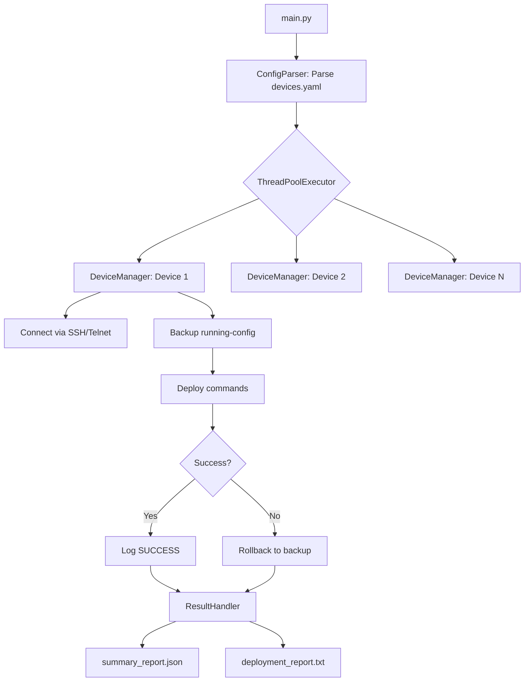

# PNetGimini

[](https://doi.org/10.5281/zenodo.XXXXXXX)
[](https://opensource.org/licenses/MIT)
[](https://www.python.org/downloads/)

**Provisioning Network Gemini System** — A network automation deployment system inspired by CAE methodology.

## Overview

PNetGimini is a network automation tool that borrows from CAE (Computer-Aided Engineering) methodology for segmenting complex simulation tasks. It deploys configurations to multi-vendor network devices (Cisco/Huawei) via SSH/Telnet, with automatic backup, rollback, and structured reporting.

Inspired by finite element analysis (FEA) domain decomposition methods, the system **lays the foundation to** treat network configuration as a multi-physics problem — separating basic data (IP/VLAN), routing convergence (OSPF/BGP), and post-processing (security/QoS) into distinct execution blocks with appropriate timing. A fully physics-aware engine with ODE-based prediction is planned for our next major release (**Sentinel CPNA**).

## Features

- **YAML-based Configuration** — Structured device inventory and command definitions
- **Multi-threaded Deployment** — ThreadPoolExecutor for parallel device provisioning
- **Automatic Pre-change Backup** — Snapshots running-config before any modification
- **Rollback Mechanism** — Auto-restore on connection failure or execution error
- **Dual-format Reports** — JSON (machine-readable) + TXT (human-readable)
- **Reverse Engineering Tool** — Extract commands from .conf backups to generate recovery YAML
- **Project-level Isolation** — Configs, logs, outputs scoped to project directory
- **Real-time Terminal Output** — Live command execution feedback
- **Logging System** — RotatingFileHandler for automatic log management
- **Network Topology Support** — Cisco Packet Tracer topology for lab simulation

### Deployment Flow



## Architecture

```
PNetGimini/
├── main.py                     # Entry point: CLI parsing + ThreadPool dispatch
├── src/
│   ├── models/
│   │   ├── device.py           # Device model: IP, port, credentials, commands
│   │   └── command.py          # Command model: category (config/show) + commands
│   ├── core/
│   │   ├── config_parser.py    # YAML parser → Device/Command objects
│   │   ├── device_manager.py   # SSH/Telnet connection + execute + backup + rollback
│   │   └── result_handler.py   # JSON/TXT report generation
│   └── utils/
│       └── logger.py           # RotatingFileHandler logging
├── configs/
│   ├── devices.yaml            # Main device configuration file
│   └── devices_enetlab.pkt     # Cisco Packet Tracer lab topology
├── logs/                       # System runtime logs (auto-generated)
├── outputs/                    # Deployment reports and snapshots
│   ├── deployment_report_*.txt # Human-readable deployment reports
│   └── summary_report_*.json   # Machine-readable summary reports
├── config_to_yaml.py           # Reverse tool: .conf → YAML recovery script
└── requirements.txt            # Python dependencies
```

## Installation

### Prerequisites

- Python 3.8+
- Network devices (physical or simulated via EVE-NG/PNETLab)
- Cisco Packet Tracer (optional, for viewing the lab topology)

### Setup

```bash
# Clone the repository
git clone https://github.com/shaolinzhou/PNetGimini.git
cd PNetGimini

# Create virtual environment
python -m venv venv
venv\Scripts\activate        # Windows
# source venv/bin/activate   # Linux/Mac

# Install dependencies
pip install -r requirements.txt
```

## Usage

### 1. Prepare Network Topology

The repository includes a **Cisco Packet Tracer** topology file (`configs/devices_enetlab.pkt`) that defines the lab network.

> **Note**: `.pkt` files are native to Cisco Packet Tracer and cannot be directly imported into EVE-NG/PNETLab. If you are using EVE-NG, you will need to recreate the topology using EVE-NG's `.unl` format or import devices manually.

### 2. Configure Devices

Edit `configs/devices.yaml` with your device configurations:

```yaml
devices:
  - ip: 10.48.80.40          # Management IP (e.g., EVE-NG host)
    port: 30001               # Console port
    username: admin
    password: admin
    device_type: cisco_ios_telnet
    commands:
      config:
        - hostname R1
        - interface e0/0
        - ip address 192.168.1.1 255.255.255.0
        - no shutdown
      show:
        - show ip interface brief
        - show ip route
```

> **Security Warning**: Do not store plain-text production credentials in `devices.yaml`. This file is designed for lab/educational use. Integration with HashiCorp Vault and environment variable support is planned in our roadmap.

### 3. Deploy Configurations

```bash
# Default config: configs/devices.yaml
python main.py

# Specify custom config file
python main.py configs/custom_config.yaml
```

### 4. Reverse Engineering (Recovery)

```bash
# Convert .conf backups to recovery YAML
python config_to_yaml.py
```

## Network Topology

### Lab Topology: `configs/devices_enetlab.pkt`

- **Format**: Cisco Packet Tracer (.pkt)
- **Purpose**: Reference topology for lab simulation
- **Usage**: Open in Cisco Packet Tracer to view the network design

### Topology Components

The topology includes:
- **Cisco Routers** — R0, R1, R2, R3, R4
- **Cisco Switches** — SW0, SW1, SW2, SW3, SW4, M-SW0, M-SW1, M-SW2
- **VLAN configurations** — VLAN 10, 20, 30, 40, 50
- **Routing protocols** — RIP, OSPF
- **NAT/PAT configurations**
- **DHCP pools**

### Mapping Topology to devices.yaml

```yaml
# Example mapping from topology to devices.yaml
devices:
  - ip: 10.48.80.40      # Host management IP
    port: 30001           # Console port for Router R0
    username: admin
    password: admin
    device_type: cisco_ios_telnet
    commands:
      config:
        - hostname R0
        # ... configuration commands
```

## Output Structure

### Logs Directory (`logs/`)

```
logs/
└── automation.log           # System runtime logs (auto-rotated, max 10MB × 5 files)
```

### Outputs Directory (`outputs/`)

```
outputs/
├── deployment_report_{timestamp}.txt     # Human-readable deployment report
└── summary_report_{timestamp}.json       # Machine-readable summary report
```

### Report Contents

**Deployment Report (TXT)**:
- Device connection status
- Command execution results
- Error messages and rollback actions
- Timestamp and duration

**Summary Report (JSON)**:
- Total devices processed
- Success/error counts
- Individual device status
- Execution metadata

## Configuration Reference

### Device Configuration (devices.yaml)

```yaml
devices:
  - ip: <management_ip>
    port: <console_port>
    username: <username>
    password: <password>
    device_type: cisco_ios_telnet  # or cisco_ios_ssh, huawei_telnet, etc.
    commands:
      config:
        - <configuration_command_1>
        - <configuration_command_2>
      show:
        - <show_command_1>
        - <show_command_2>
```

### Supported Device Types

| Device Type | Protocol | Platform |
|-------------|----------|----------|
| `cisco_ios_telnet` | Telnet | Cisco IOS |
| `cisco_ios_ssh` | SSH | Cisco IOS |
| `huawei_telnet` | Telnet | Huawei VRP |
| `huawei_ssh` | SSH | Huawei VRP |

## Version History

| Version | Changes |
|---------|---------|
| v2.0.1 | Zenodo integration, citation metadata (CITATION.cff, .zenodo.json), documentation enhancements |
| v2.0 | First official release with YAML config, multi-threading, backup/rollback, and reports |
| v1.6 | Fixed report output file overwrite bug |
| v1.5 | Added real-time terminal output |
| v1.4 | Added special handling for ping command timeout |
| v1.3 | Fixed file path resolution error |
| v1.2 | Migrated to YAML configuration format |
| v1.1 | Fixed configuration file parsing failure |
| v1.0 | Initial implementation with custom # markup parsing |

## Roadmap

### Current (v2.0)

- ✅ YAML-based configuration
- ✅ Multi-threaded deployment
- ✅ Automatic backup and rollback
- ✅ Dual-format reports
- ✅ Real-time terminal output
- ✅ Network topology support

### Future Vision: Sentinel CPNA

- **Async I/O Engine** — Migrate from ThreadPool to pure asyncio
- **gNMI/NETCONF Support** — Replace CLI with model-driven protocols
- **Physics-Aware Engine** — ODE-based temperature/load → network delay prediction
- **Dynamic Concurrency** — Adjust parallel connections based on device health score
- **CMDB Integration** — NetBox/ServiceNow for asset lifecycle context
- **MQTT Sensor Integration** — External environmental monitoring
- **Vault Integration** — Secure credential management via HashiCorp Vault

## Contributing

1. Fork the repository
2. Create a feature branch (`git checkout -b feature/amazing-feature`)
3. Commit your changes (`git commit -m 'Add amazing feature'`)
4. Push to the branch (`git push origin feature/amazing-feature`)
5. Open a Pull Request

## License

This project is licensed under the MIT License - see the [LICENSE](LICENSE) file for details.

## Acknowledgments

- Inspired by CAE (Computer-Aided Engineering) methodology and FEA domain decomposition
- Built with [Netmiko](https://github.com/ktbyers/netmiko) for network device communication
- Designed for EVE-NG/PNETLab simulation environments

## Citation

If you use this software in your research, please cite it as:

```bibtex
@software{zhou2026pnetgimini,
  author       = {Zhou, Shaolin},
  title        = {PNetGimini: Provisioning Network Gemini System},
  year         = {2026},
  publisher    = {Zenodo},
  version      = {2.0.1},
  doi          = {10.5281/zenodo.XXXXXXX},
  url          = {https://github.com/shaolinzhou/PNetGimini}
}
```

Or using the [CITATION.cff](CITATION.cff) file included in this repository.
