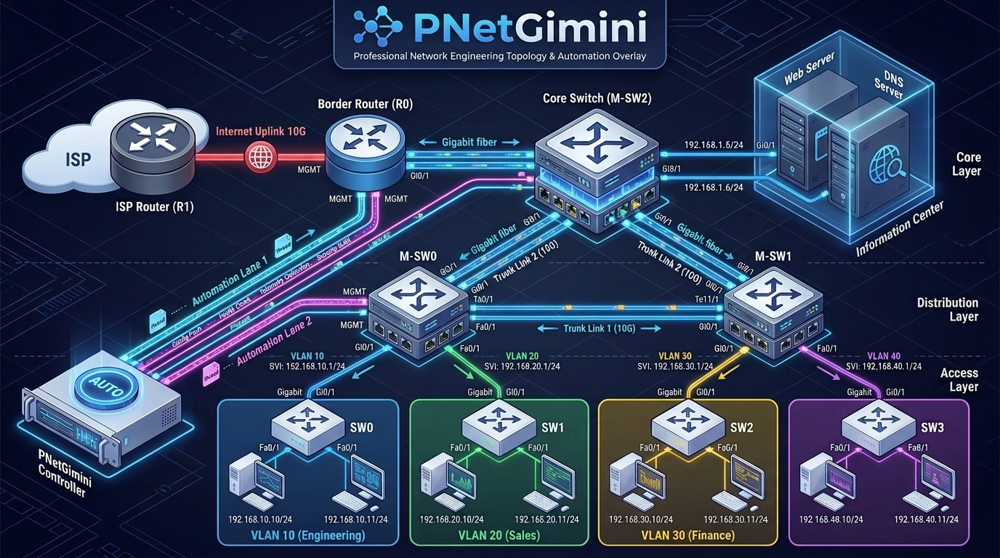
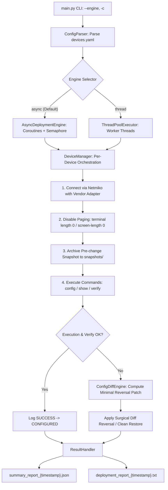

# PNetGimini

<p align="center">
  
</p>

<p align="center">
  <a href="https://doi.org/10.5281/zenodo.22649486"></a>
  <a href="https://opensource.org/licenses/Apache-2.0"></a>
  <a href="https://www.python.org/downloads/"></a>
</p>

<p align="center">
  <strong>Provisioning Network Gemini System</strong> — A physics-aware network automation deployment system inspired by CAE methodology.
</p>

## Overview

PNetGimini is a network automation tool that borrows from CAE (Computer-Aided Engineering) methodology for segmenting complex simulation tasks. It deploys configurations to multi-vendor network devices (Cisco/Huawei) via SSH/Telnet, with automatic backup, rollback, and structured reporting.

Inspired by finite element analysis (FEA) domain decomposition methods, the system **lays the foundation to** treat network configuration as a multi-physics problem — separating basic data (IP/VLAN), routing convergence (OSPF/BGP), and post-processing (security/QoS) into distinct execution blocks with appropriate timing. A fully physics-aware engine with ODE-based prediction is planned for our next major release (**Sentinel CPNA**).

## Features
 
- **High-Concurrency Async Engine** — Python `asyncio` coroutines + dynamic Semaphore for large-scale device fleets (100+ nodes)
- **Intelligent Diff-based Rollback** — Calculates surgical reversal patches (undo only what changed) to eliminate syntax errors from blind full-config overwriting
- **Multi-Vendor Driver Adapters** — Decoupled adapter layer (`AdapterFactory`, `CiscoAdapter`, `HuaweiAdapter`) for pagination, snapshots, and command negations
- **YAML-based Configuration** — Structured device inventory and command definitions
- **Structured Snapshot Lifecycle** — Automatic pre-change snapshot archival into `snapshots/` subdirectories
- **Dual-format Reports** — Machine-readable JSON + human-readable TXT deployment audits
- **Reverse Engineering Tool** — Automatically extracts configuration from `.conf` snapshots to reconstruct YAML recovery templates
- **Project-level Isolation** — Configs, logs, outputs scoped to project directory
- **Real-time Terminal Output** — Live command execution feedback
- **Logging System** — RotatingFileHandler for automatic log management
- **Network Topology Support** — Cisco Packet Tracer topology for lab simulation

### Deployment Flow



## Architecture

```
PNetGimini/
├── main.py                     # Entry point: CLI parsing (--engine, -c) + Async/Thread dispatch
├── src/
│   ├── models/
│   │   ├── device.py           # Device model: IP, port, credentials, commands
│   │   └── command.py          # Command model: category (config/show/verify) + commands
│   ├── core/
│   │   ├── adapters/           # Multi-vendor driver adapters (Cisco, Huawei, Factory)
│   │   ├── async_engine.py     # Asyncio coroutine deployment engine (high concurrency)
│   │   ├── config_diff.py      # Intelligent diff-based precision rollback engine
│   │   ├── config_parser.py    # YAML parser → Device/Command objects
│   │   ├── device_manager.py   # Connection lifecycle, pre-change snapshot, self-healing
│   │   └── result_handler.py   # JSON/TXT deployment audit report generation
│   └── utils/
│       └── logger.py           # RotatingFileHandler logging
├── tests/                      # Automated test suite (offline-safe unit tests)
│   └── test_core.py            # Adapters, diff rollback, and async engine tests
├── configs/
│   ├── devices.yaml            # Main device configuration inventory
│   ├── latest_recovery.yaml    # Auto-generated disaster recovery template
│   ├── snapshots/              # Pre-change .conf snapshot archives
│   └── devices_enetlab.pkt     # Cisco Packet Tracer lab topology
├── logs/                       # System runtime logs (auto-rotated)
├── outputs/                    # Deployment reports and audit trails
├── config_to_yaml.py           # Reverse tool: snapshots/ → YAML recovery template
└── requirements.txt            # Python dependencies (netmiko, pyyaml)
```

## Installation

### Prerequisites

- Python 3.8+
- Network devices (physical or simulated via EVE-NG/PNETLab)
- Cisco Packet Tracer (optional, for viewing the lab topology)

### Setup

```bash
# Clone the repository
git clone https://github.com/shaolinzhou/PNetGimini.git
cd PNetGimini

# Create virtual environment
python -m venv venv
venv\Scripts\activate        # Windows
# source venv/bin/activate   # Linux/Mac

# Install dependencies
pip install -r requirements.txt
```

## Usage

### 1. Prepare Network Topology

The repository includes a **Cisco Packet Tracer** topology file (`configs/devices_enetlab.pkt`) that defines the lab network.

> **Note**: `.pkt` files are native to Cisco Packet Tracer and cannot be directly imported into EVE-NG/PNETLab. If you are using EVE-NG, you will need to recreate the topology using EVE-NG's `.unl` format or import devices manually.

### 2. Configure Devices

Edit `configs/devices.yaml` with your device configurations:

```yaml
devices:
  - ip: 10.48.80.40          # Management IP (e.g., EVE-NG host)
    port: 30001               # Console port
    username: admin
    password: admin
    device_type: cisco_ios_telnet
    commands:
      config:
        - hostname R1
        - interface e0/0
        - ip address 192.168.1.1 255.255.255.0
        - no shutdown
      show:
        - show ip interface brief
        - show ip route
      verify:
        - ping 192.168.1.254
```

> **Security Warning**: Do not store plain-text production credentials in `devices.yaml`. This file is designed for lab/educational use. Integration with HashiCorp Vault and environment variable support is planned in our roadmap.

### 3. Deploy Configurations

PNetGimini provides flexible execution engines and concurrency tuning via CLI arguments:

```bash
# 1. Standard Run: High-concurrency Asyncio engine (default, 10 workers)
python main.py

# 2. High-Scale Deployment: Asyncio engine with 20 concurrent connections
python main.py -c 20

# 3. Custom Inventory Path
python main.py configs/custom_config.yaml -c 15

# 4. Classic ThreadPool Mode (for benchmark comparison or legacy environments)
python main.py --engine thread -c 5
```

CLI Parameters:
| Option | Default | Description |
|---|---|---|
| `config` | `configs/devices.yaml` | Positional path to the target YAML inventory |
| `--engine` | `async` | Execution engine: `async` (asyncio coroutines) or `thread` (`ThreadPoolExecutor`) |
| `-c, --concurrency` | `10` | Maximum number of concurrent device connections |

### 4. Reverse Engineering & Disaster Recovery

Automatically scan latest pre-change snapshots and reconstruct a pristine YAML recovery file:

```bash
# Convert latest snapshots from configs/snapshots/ into configs/latest_recovery.yaml
python config_to_yaml.py

# Execute disaster recovery
python main.py configs/latest_recovery.yaml
```

### 5. Running Automated Tests

Run the offline-safe automated unit test suite (validates adapters, diff rollback, and async engine in <1 second):

```bash
python -m unittest discover -s tests -p "test_*.py"
```

## Documentation Index

Detailed architectural and procedural documentation is partitioned across subdirectories:

| Document | Scope & Contents |
|---|---|
| 📖 [**`src/core/README.md`**](src/core/README.md) | **Core Engine Architecture**: Asyncio coroutine engine, diff-based precision rollback algorithms, multi-vendor adapter design (Cisco vs. Huawei), and self-healing lifecycle. |
| 🧪 [**`tests/README.md`**](tests/README.md) | **Test Suite Guide**: Unit test breakdown, non-destructive mocking strategy, and testing command references. |
| ⚙️ [**`configs/README.md`**](configs/README.md) | **Configuration & Snapshots**: `devices.yaml` syntax specification (`config`, `show`, `verify`), snapshot naming conventions, and recovery workflows. |

## Network Topology

### Lab Topology: `configs/devices_enetlab.pkt`

- **Format**: Cisco Packet Tracer (.pkt)
- **Purpose**: Reference topology for lab simulation
- **Usage**: Open in Cisco Packet Tracer to view the network design

### Topology Components

The topology includes:
- **Cisco Routers** — R0, R1, R2, R3, R4
- **Cisco Switches** — SW0, SW1, SW2, SW3, SW4, M-SW0, M-SW1, M-SW2
- **VLAN configurations** — VLAN 10, 20, 30, 40, 50
- **Routing protocols** — RIP, OSPF
- **NAT/PAT configurations**
- **DHCP pools**

### Mapping Topology to devices.yaml

```yaml
# Example mapping from topology to devices.yaml
devices:
  - ip: 10.48.80.40      # Host management IP
    port: 30001           # Console port for Router R0
    username: admin
    password: admin
    device_type: cisco_ios_telnet
    commands:
      config:
        - hostname R0
        # ... configuration commands
```

## Output Structure

### Logs Directory (`logs/`)

```
logs/
└── automation.log           # System runtime logs (auto-rotated, max 10MB × 5 files)
```

### Outputs Directory (`outputs/`)

```
outputs/
├── deployment_report_{timestamp}.txt     # Human-readable deployment report
└── summary_report_{timestamp}.json       # Machine-readable summary report
```

### Report Contents

**Deployment Report (TXT)**:
- Device connection status
- Command execution results
- Error messages and rollback actions
- Timestamp and duration

**Summary Report (JSON)**:
- Total devices processed
- Success/error counts
- Individual device status
- Execution metadata

## Configuration Reference

### Device Configuration (devices.yaml)

```yaml
devices:
  - ip: <management_ip>
    port: <console_port>
    username: <username>
    password: <password>
    device_type: cisco_ios_telnet  # or cisco_ios_ssh, huawei_telnet, etc.
    commands:
      config:
        - <configuration_command_1>
        - <configuration_command_2>
      show:
        - <show_command_1>
        - <show_command_2>
```

### Supported Device Types

| Device Type | Protocol | Platform |
|-------------|----------|----------|
| `cisco_ios_telnet` | Telnet | Cisco IOS |
| `cisco_ios_ssh` | SSH | Cisco IOS |
| `huawei_telnet` | Telnet | Huawei VRP |
| `huawei_ssh` | SSH | Huawei VRP |

## Version History

| Version | Changes |
|---------|---------|
| v3.0 | Major Milestone Release: Asyncio high-concurrency engine, Diff-based precision rollback, multi-vendor adapters (Cisco/Huawei), full integration test suite, structured snapshot lifecycle |
| v2.1 | Pre-release architecture upgrade (Asyncio engine & diff rollback development) |
| v2.0.1 | Zenodo integration, citation metadata (CITATION.cff, .zenodo.json), documentation enhancements |
| v2.0 | First official release with YAML config, multi-threading, backup/rollback, and reports |
| v1.6 | Fixed report output file overwrite bug |
| v1.5 | Added real-time terminal output |
| v1.4 | Added special handling for ping command timeout |
| v1.3 | Fixed file path resolution error |
| v1.2 | Migrated to YAML configuration format |
| v1.1 | Fixed configuration file parsing failure |
| v1.0 | Initial implementation with custom # markup parsing |

## Roadmap

### Current (v3.0)

- ✅ YAML-based configuration & reverse recovery tool
- ✅ High-concurrency Asyncio coroutine engine (`AsyncDeploymentEngine`)
- ✅ Multi-threaded fallback deployment (`ThreadPoolExecutor`)
- ✅ Intelligent diff-based precision rollback (`ConfigDiffEngine`)
- ✅ Multi-vendor driver adapters (`CiscoAdapter`, `HuaweiAdapter`)
- ✅ Structured pre-change snapshot lifecycle (`configs/snapshots/`)
- ✅ Automated offline unit & integration test suites (`tests/`)
- ✅ Dual-format audit reports (JSON + TXT)
- ✅ Real-time terminal output
- ✅ Network topology simulation support (Cisco Packet Tracer)

### Future Vision: Sentinel CPNA

- **Physics-Aware ODE Engine** — ODE-based temperature/load → network convergence delay prediction
- **Dynamic Cluster Concurrency** — Dynamically adjust Semaphore windows based on device health score
- **gNMI/NETCONF Model-Driven Protocols** — Supplement CLI with Yang/gNMI telemetry streams
- **CMDB & Asset Integration** — NetBox/ServiceNow for asset lifecycle and topology context
- **MQTT Environmental Sensors** — External environmental temperature/vibration monitoring
- **Vault Integration** — Secure dynamic credential retrieval via HashiCorp Vault

## Contributing

1. Fork the repository
2. Create a feature branch (`git checkout -b feature/amazing-feature`)
3. Commit your changes (`git commit -m 'Add amazing feature'`)
4. Push to the branch (`git push origin feature/amazing-feature`)
5. Open a Pull Request

## License
 
This project is licensed under the Apache License 2.0 - see the [LICENSE](LICENSE) file for details.

## Acknowledgments

- Inspired by CAE (Computer-Aided Engineering) methodology and FEA domain decomposition
- Built with [Netmiko](https://github.com/ktbyers/netmiko) for network device communication
- Designed for EVE-NG/PNETLab simulation environments

## Citation

If you use this software in your research, please cite it as:

```bibtex
@software{zhou2026pnetgimini,
  author       = {Zhou, Shaolin},
  title        = {PNetGimini: Provisioning Network Gemini System},
  year         = {2026},
  publisher    = {Zenodo},
  version      = {3.0},
  doi          = {10.5281/zenodo.22649486},
  url          = {https://github.com/shaolinzhou/PNetGimini}
}
```

Or using the [CITATION.cff](CITATION.cff) file included in this repository.
