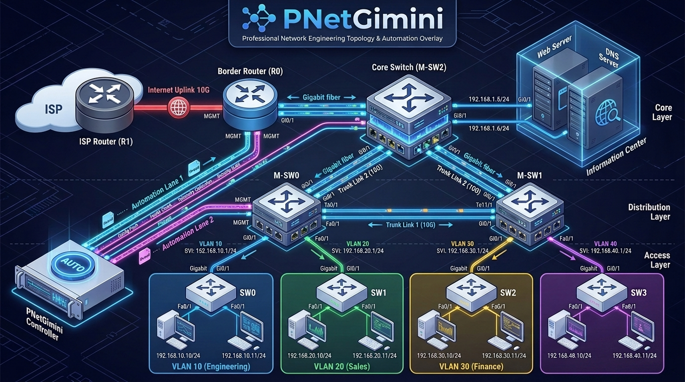
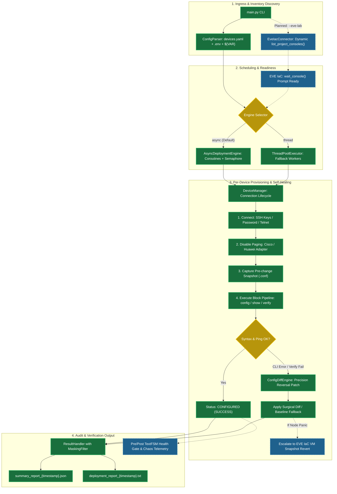

# PNetGimini

<p align="center">
  
</p>

<p align="center">
  <a href="https://doi.org/10.5281/zenodo.22650640"></a>
  <a href="https://opensource.org/licenses/Apache-2.0"></a>
  <a href="https://www.python.org/downloads/"></a>
</p>

<p align="center">
  <strong>Provisioning Network Gemini System</strong> — An enterprise-grade high-concurrency network automation deployment system.
</p>

## Overview

PNetGimini is an enterprise-grade network automation deployment system designed for high-concurrency multi-vendor environments. It deploys configurations to network devices (Cisco/Huawei) via SSH/Telnet, with automatic backup, surgical diff rollback, and structured audit reporting.

The system utilizes a highly optimized concurrency engine to orchestrate complex multi-device deployments. By partitioning network configurations into isolated, sequential execution blocks—such as separating basic bootstrap data (IP/VLAN), routing convergence (OSPF/BGP), and post-processing services (security/QoS)—the engine deploys configurations in parallel across all target nodes. This structured, thread-safe approach eliminates command race conditions, optimizes CPU and network I/O performance, and ensures deterministic, orderly state transitions across the entire hierarchical topology without blocking.

## Features
 
- **High-Concurrency Async Engine** — Python `asyncio` coroutines + dynamic Semaphore for large-scale device fleets (100+ nodes)
- **Intelligent Diff-based Rollback** — Calculates surgical reversal patches (undo only what changed) to eliminate syntax errors from blind full-config overwriting
- **Multi-Vendor Driver Adapters** — Decoupled adapter layer (`AdapterFactory`, `CiscoAdapter`, `HuaweiAdapter`) for pagination, snapshots, and command negations
- **YAML-based Configuration** — Structured device inventory and command definitions
- **Structured Snapshot Lifecycle** — Automatic pre-change snapshot archival into `snapshots/` subdirectories
- **Dual-format Reports** — Machine-readable JSON + human-readable TXT deployment audits with automatic credential masking
- **Enterprise Security & Desensitization (v3.1)** — Dynamic environment variable interpolation (`${VAR:-default}`), automated `.env` loading, and real-time credential redaction (`MaskingFilter`) across all logs and audit reports
- **Flexible Authentication** — Support for SSH passwords, SSH private keys (with passphrases), enable secrets, and passwordless console sessions (EVE-NG / PNETLab)
- **Reverse Engineering Tool** — Automatically extracts configuration from `.conf` snapshots to reconstruct YAML recovery templates
- **Project-level Isolation** — Configs, logs, outputs scoped to project directory
- **Real-time Terminal Output** — Live command execution feedback
- **Logging System** — RotatingFileHandler for automatic log management with integrated credential masking
- **Network Topology Support** — Cisco Packet Tracer topology for lab simulation

### Deployment Flow


```mermaid
flowchart TD
    %% Status Styling Classes
    classDef implemented fill:#196f3d,stroke:#27ae60,stroke-width:2px,color:#ffffff;
    classDef planned fill:#1f618d,stroke:#5499c7,stroke-width:2px,stroke-dasharray: 4 4,color:#ffffff;
    classDef decision fill:#b7950b,stroke:#f1c40f,stroke-width:2px,color:#ffffff;

    subgraph Stage1 ["1. Ingress & Inventory Discovery"]
        A["main.py CLI"]:::implemented
        B1["ConfigParser: devices.yaml + .env + ${VAR}"]:::implemented
        B2["EveIacConnector: Dynamic list_project_consoles()"]:::planned
        A --> B1
        A -.->|"Planned: --eve-lab"| B2
    end

    subgraph Stage2 ["2. Scheduling & Readiness"]
        W["EVE IaC: wait_console() Prompt Ready"]:::planned
        C{"Engine Selector"}:::decision
        D1["AsyncDeploymentEngine: Coroutines + Semaphore"]:::implemented
        D2["ThreadPoolExecutor: Fallback Workers"]:::implemented
        B1 --> C
        B2 -.-> W
        W -.-> C
        C -->|"async (Default)"| D1
        C -->|"thread"| D2
    end

    subgraph Stage3 ["3. Per-Device Provisioning & Self-Healing"]
        E["DeviceManager: Connection Lifecycle"]:::implemented
        D1 --> E
        D2 --> E
        F1["1. Connect: SSH Keys / Password / Telnet"]:::implemented
        F2["2. Disable Paging: Cisco / Huawei Adapter"]:::implemented
        F3["3. Capture Pre-change Snapshot (.conf)"]:::implemented
        F4["4. Execute Block Pipeline: config / show / verify"]:::implemented
        F5{"Syntax & Ping OK?"}:::decision
        F6["Status: CONFIGURED (SUCCESS)"]:::implemented
        F7["ConfigDiffEngine: Precision Reversal Patch"]:::implemented
        F8["Apply Surgical Diff / Baseline Fallback"]:::implemented
        F9["Escalate to EVE IaC VM Snapshot Revert"]:::planned

        E --> F1 --> F2 --> F3 --> F4 --> F5
        F5 -->|"Yes"| F6
        F5 -->|"CLI Error / Verify Fail"| F7
        F7 --> F8
        F8 -.->|"If Node Panic"| F9
    end

    subgraph Stage4 ["4. Audit & Verification Output"]
        G["ResultHandler with MaskingFilter"]:::implemented
        H1["summary_report_{timestamp}.json"]:::implemented
        H2["deployment_report_{timestamp}.txt"]:::implemented
        H3["Pre/Post TextFSM Health Gate & Chaos Telemetry"]:::planned

        F6 --> G
        F8 --> G
        G --> H1
        G --> H2
        F6 -.-> H3
    end
```

> **Legend**:
> - 🟩 **Solid Green**: **Currently Implemented & Production-Ready** (v3.1 Baseline, 25/25 Tests Passing)
> - 🟨 **Solid Gold**: **Decision & Control Flow Gate** (Engine Selector / Syntax & Ping Verification)
> - 🟦 **Dashed Blue**: **Planned EVE IaC & Digital Twin Integrations** (Roadmap Architecture)

## Architecture

```
PNetGimini/
├── main.py                     # Entry point: CLI parsing (--engine, -c) + Async/Thread dispatch
├── .env.example                # Environment configuration template
├── src/
│   ├── models/
│   │   ├── device.py           # Device model: IP, port, credentials, SSH keys, commands
│   │   └── command.py          # Command model: category (config/show/verify) + commands
│   ├── core/
│   │   ├── adapters/           # Multi-vendor driver adapters (Cisco, Huawei, Factory)
│   │   ├── async_engine.py     # Asyncio coroutine deployment engine (high concurrency)
│   │   ├── config_diff.py      # Intelligent diff-based precision rollback engine
│   │   ├── config_parser.py    # YAML parser + ${VAR:-default} env interpolation + .env
│   │   ├── device_manager.py   # Connection lifecycle, pre-change snapshot, self-healing
│   │   └── result_handler.py   # JSON/TXT deployment audit report generation
│   └── utils/
│       ├── logger.py           # RotatingFileHandler logging
│       └── masking.py          # Real-time sensitive credential desensitization (MaskingFilter)
├── tests/                      # Automated test suite (25 offline-safe unit & integration tests)
│   ├── test_core.py            # Adapters, diff rollback, and async engine tests
│   ├── test_full_pipeline.py   # End-to-end execution, syntax traps, and verification tests
│   └── test_v31_security.py    # Env expansion, credential masking, and SSH key tests
├── configs/
│   ├── devices.yaml            # Main device configuration inventory
│   ├── latest_recovery.yaml    # Auto-generated disaster recovery template
│   ├── snapshots/              # Pre-change .conf snapshot archives
│   └── devices_enetlab.pkt     # Cisco Packet Tracer lab topology
├── logs/                       # System runtime logs (auto-rotated & credential-masked)
├── outputs/                    # Deployment reports and audit trails (credential-masked)
├── config_to_yaml.py           # Reverse tool: snapshots/ → YAML recovery template
└── requirements.txt            # Python dependencies (netmiko, pyyaml)
```

## Installation

### Prerequisites

- Python 3.8+
- Network devices (physical or simulated via EVE-NG/PNETLab)
- Cisco Packet Tracer (optional, for viewing the lab topology)

### Setup

```bash
# Clone the repository
git clone https://github.com/shaolinzhou/PNetGimini.git
cd PNetGimini

# Create virtual environment
python -m venv venv
venv\Scripts\activate        # Windows
# source venv/bin/activate   # Linux/Mac

# Install dependencies
pip install -r requirements.txt
```

## Usage

### 1. Prepare Network Topology

The repository includes a **Cisco Packet Tracer** topology file (`configs/devices_enetlab.pkt`) that defines the lab network.

> **Note**: `.pkt` files are native to Cisco Packet Tracer and cannot be directly imported into EVE-NG/PNETLab. If you are using EVE-NG, you will need to recreate the topology using EVE-NG's `.unl` format or import devices manually.

### 2. Configure Devices

Edit `configs/devices.yaml` with your device configurations:

```yaml
devices:
  - ip: 10.48.80.40          # Management IP (e.g., EVE-NG host)
    port: 30001               # Console port
    username: admin
    password: admin
    device_type: cisco_ios_telnet
    commands:
      config:
        - hostname R1
        - interface e0/0
        - ip address 192.168.1.1 255.255.255.0
        - no shutdown
      show:
        - show ip interface brief
        - show ip route
      verify:
        - ping 192.168.1.254
```

> **Security Warning**: Do not store plain-text production credentials in `devices.yaml`. This file is designed for lab/educational use. Integration with HashiCorp Vault and environment variable support is planned in our roadmap.

### 3. Deploy Configurations

PNetGimini provides flexible execution engines and concurrency tuning via CLI arguments:

```bash
# 1. Standard Run: High-concurrency Asyncio engine (default, 10 workers)
python main.py

# 2. High-Scale Deployment: Asyncio engine with 20 concurrent connections
python main.py -c 20

# 3. Custom Inventory Path
python main.py configs/custom_config.yaml -c 15

# 4. Classic ThreadPool Mode (for benchmark comparison or legacy environments)
python main.py --engine thread -c 5
```

CLI Parameters:
| Option | Default | Description |
|---|---|---|
| `config` | `configs/devices.yaml` | Positional path to the target YAML inventory |
| `--engine` | `async` | Execution engine: `async` (asyncio coroutines) or `thread` (`ThreadPoolExecutor`) |
| `-c, --concurrency` | `10` | Maximum number of concurrent device connections |

### 4. Reverse Engineering & Disaster Recovery

Automatically scan latest pre-change snapshots and reconstruct a pristine YAML recovery file:

```bash
# Convert latest snapshots from configs/snapshots/ into configs/latest_recovery.yaml
python config_to_yaml.py

# Execute disaster recovery
python main.py configs/latest_recovery.yaml
```

### 5. Running Automated Tests

Run the offline-safe automated unit test suite (validates adapters, diff rollback, and async engine in <1 second):

```bash
python -m unittest discover -s tests -p "test_*.py"
```

## Documentation Index

Detailed architectural and procedural documentation is partitioned across subdirectories:

| Document | Scope & Contents |
|---|---|
| 📖 [**`src/core/README.md`**](src/core/README.md) | **Core Engine Architecture**: Asyncio coroutine engine, diff-based precision rollback algorithms, multi-vendor adapter design (Cisco vs. Huawei), and self-healing lifecycle. |
| 🧪 [**`tests/README.md`**](tests/README.md) | **Test Suite Guide**: Unit test breakdown, non-destructive mocking strategy, and testing command references. |
| ⚙️ [**`configs/README.md`**](configs/README.md) | **Configuration & Snapshots**: `devices.yaml` syntax specification (`config`, `show`, `verify`), snapshot naming conventions, and recovery workflows. |

## Network Topology

### Lab Topology: `configs/devices_enetlab.pkt`

- **Format**: Cisco Packet Tracer (.pkt)
- **Purpose**: Reference topology for lab simulation
- **Usage**: Open in Cisco Packet Tracer to view the network design

### Topology Components

The topology includes:
- **Cisco Routers** — R0, R1, R2, R3, R4
- **Cisco Switches** — SW0, SW1, SW2, SW3, SW4, M-SW0, M-SW1, M-SW2
- **VLAN configurations** — VLAN 10, 20, 30, 40, 50
- **Routing protocols** — RIP, OSPF
- **NAT/PAT configurations**
- **DHCP pools**

### Mapping Topology to devices.yaml

```yaml
# Example mapping from topology to devices.yaml
devices:
  - ip: 10.48.80.40      # Host management IP
    port: 30001           # Console port for Router R0
    username: admin
    password: admin
    device_type: cisco_ios_telnet
    commands:
      config:
        - hostname R0
        # ... configuration commands
```

## Output Structure

### Logs Directory (`logs/`)

```
logs/
└── automation.log           # System runtime logs (auto-rotated, max 10MB × 5 files)
```

### Outputs Directory (`outputs/`)

```
outputs/
├── deployment_report_{timestamp}.txt     # Human-readable deployment report
└── summary_report_{timestamp}.json       # Machine-readable summary report
```

### Report Contents

**Deployment Report (TXT)**:
- Device connection status
- Command execution results
- Error messages and rollback actions
- Timestamp and duration

**Summary Report (JSON)**:
- Total devices processed
- Success/error counts
- Individual device status
- Execution metadata

## Configuration Reference

### Device Configuration (devices.yaml)

```yaml
devices:
  - ip: <management_ip>
    port: <console_port>
    username: <username>
    password: <password>
    device_type: cisco_ios_telnet  # or cisco_ios_ssh, huawei_telnet, etc.
    commands:
      config:
        - <configuration_command_1>
        - <configuration_command_2>
      show:
        - <show_command_1>
        - <show_command_2>
```

### Supported Device Types

| Device Type | Protocol | Platform |
|-------------|----------|----------|
| `cisco_ios_telnet` | Telnet | Cisco IOS |
| `cisco_ios_ssh` | SSH | Cisco IOS |
| `huawei_telnet` | Telnet | Huawei VRP |
| `huawei_ssh` | SSH | Huawei VRP |

## Version History

| Version | Changes |
|---------|---------|
| v3.1 | Enterprise Security & Credential Desensitization: Dynamic env interpolation (`${VAR:-default}`), automated `.env` loading, `MaskingFilter` for console/file logs and audit reports, SSH key authentication, passwordless console sessions, expanded test suite (25/25 passing) |
| v3.0 | Major Milestone Release: Asyncio high-concurrency engine, Diff-based precision rollback, multi-vendor adapters (Cisco/Huawei), full integration test suite, structured snapshot lifecycle |
| v2.1 | Pre-release architecture upgrade (Asyncio engine & diff rollback development) |
| v2.0.1 | Zenodo integration, citation metadata (CITATION.cff, .zenodo.json), documentation enhancements |
| v2.0 | First official release with YAML config, multi-threading, backup/rollback, and reports |
| v1.6 | Fixed report output file overwrite bug |
| v1.5 | Added real-time terminal output |
| v1.4 | Added special handling for ping command timeout |
| v1.3 | Fixed file path resolution error |
| v1.2 | Migrated to YAML configuration format |
| v1.1 | Fixed configuration file parsing failure |
| v1.0 | Initial implementation with custom # markup parsing |

## Roadmap

### Current (v3.1)

- ✅ YAML-based configuration & reverse recovery tool
- ✅ Dynamic environment variable interpolation (`${VAR:-default}`) & `.env` configuration
- ✅ High-concurrency Asyncio coroutine engine (`AsyncDeploymentEngine`)
- ✅ Multi-threaded fallback deployment (`ThreadPoolExecutor`)
- ✅ Intelligent diff-based precision rollback (`ConfigDiffEngine`)
- ✅ Multi-vendor driver adapters (`CiscoAdapter`, `HuaweiAdapter`)
- ✅ Automated credential masking (`MaskingFilter`) across logs, JSON reports, and TXT audits
- ✅ SSH private key authentication & passwordless console support
- ✅ Structured pre-change snapshot lifecycle (`configs/snapshots/`)
- ✅ Automated offline unit & integration test suites (`tests/`, 25 passing tests)
- ✅ Dual-format audit reports (JSON + TXT)
- ✅ Real-time terminal output
- ✅ Network topology simulation support (Cisco Packet Tracer)

### Future Roadmap

- **EVE IaC Integration** — Integration with [EVE IaC](https://eve-iac.io/) via the official Python SDK (`eveiac`) to operate as a Day-1 and Day-2 operational automation provider for virtual labs and network digital twins.

## Contributing

1. Fork the repository
2. Create a feature branch (`git checkout -b feature/amazing-feature`)
3. Commit your changes (`git commit -m 'Add amazing feature'`)
4. Push to the branch (`git push origin feature/amazing-feature`)
5. Open a Pull Request

## License
 
This project is licensed under the Apache License 2.0 - see the [LICENSE](LICENSE) file for details.

## Acknowledgments

- Built with [Netmiko](https://github.com/ktbyers/netmiko) for multi-vendor network device communication
- Special thanks to [Alain Degreffe](https://www.linkedin.com/in/alaindegreffe/) ([EVE-NG](https://www.eve-ng.net/) / [EVE IaC](https://eve-iac.io/)) for architectural boundary design insights and the EVE IaC Python SDK
- Designed and tested with EVE-NG / PNETLab / Cisco Packet Tracer simulation environments

## Citation

If you use this software in your research, please cite it as:

```bibtex
@software{zhou2026pnetgimini,
  author       = {Zhou, Shaolin},
  title        = {PNetGimini: Provisioning Network Gemini System},
  year         = {2026},
  publisher    = {Zenodo},
  version      = {3.0},
  doi          = {10.5281/zenodo.22650640},
  url          = {https://github.com/shaolinzhou/PNetGimini}
}
```

Or using the [CITATION.cff](CITATION.cff) file included in this repository.
