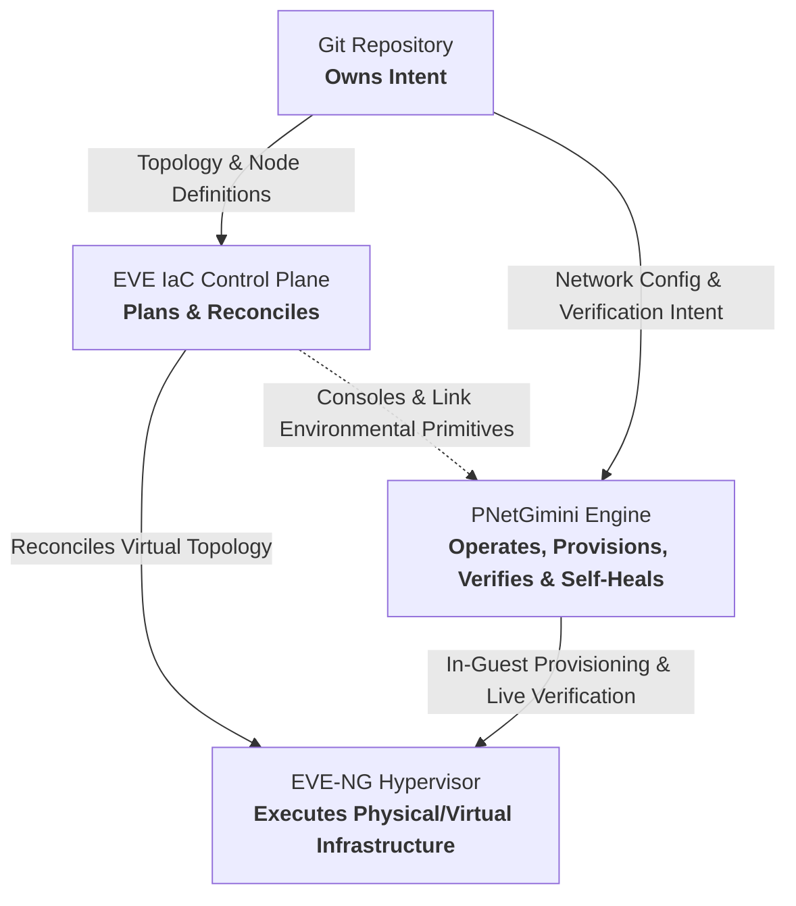
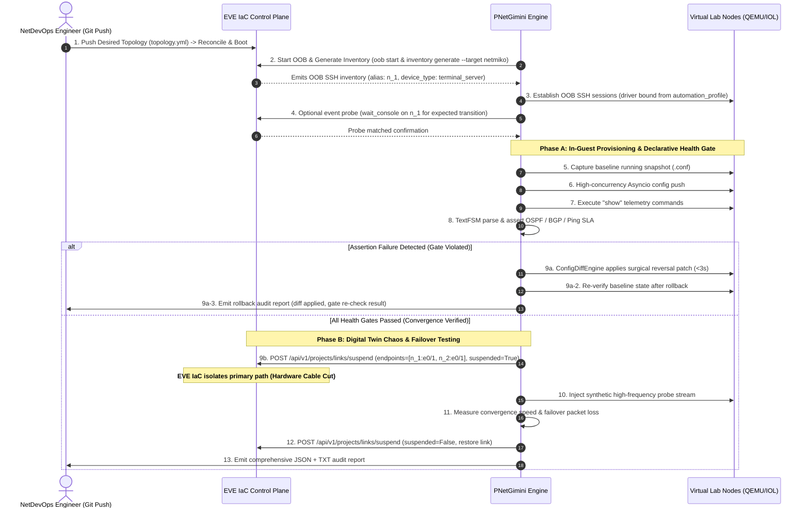
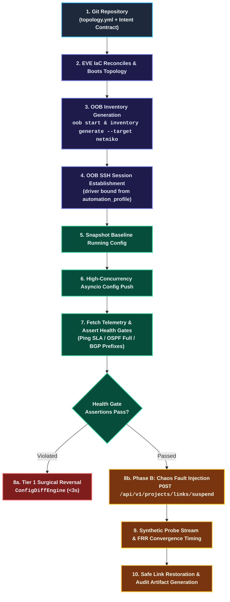
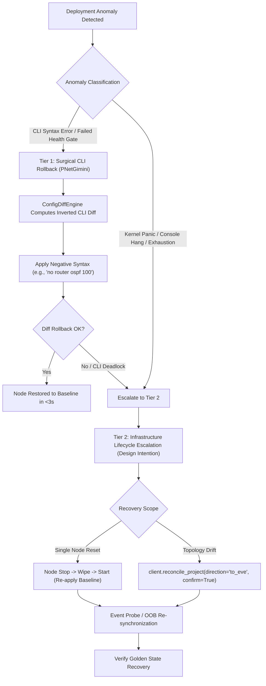

# PNetGimini & EVE IaC Architectural Integration Specification

**Document Version**: 1.2.0 (Technical Review Alignment with Alain Degreffe)  
**Status**: Approved Architecture Design Document (ADD)  
**Target Milestone**: PNetGimini v3.1 – v4.0 (v3.1–v3.3 DELIVERED, v3.5–v4.0 PLANNED)  
**Classification**: Technical Design Specification & Protocol Contract  

---

## Abstract

This document defines the formal architectural boundaries, API contracts, telemetry verification primitives, and chaos orchestration protocols between **PNetGimini** (the operational deployment and verification engine) and **EVE IaC** (the programmable Infrastructure as Code control plane for network labs and digital twins, created by EVE-NG founder Alain Degreffe).

By adhering to a strict separation of concerns—*"Git owns intent, EVE IaC plans and reconciles, EVE-NG executes, Automation tools operate the lab"*—this specification defines an architectural foundation designed to outlive ephemeral automation frameworks and support production-grade network digital twin operations.

---

## Table of Contents

1. [Architectural Separation of Concerns](#1-architectural-separation-of-concerns)
2. [The Two-Plane Operational Model](#2-the-two-plane-operational-model)
3. [EVE IaC API & Environmental Primitives Mapping](#3-eve-iac-api--environmental-primitives-mapping)
4. [Declarative Intent Specification (YAML Contract)](#4-declarative-intent-specification-yaml-contract)
5. [End-to-End Orchestration & Chaos Convergence Workflows](#5-end-to-end-orchestration--chaos-convergence-workflows)
6. [Dual-Tier Disaster Recovery & Self-Healing Protocol](#6-dual-tier-disaster-recovery--self-healing-protocol)
7. [Implementation & Traceability Roadmap](#7-implementation--traceability-roadmap)

---

## 1. Architectural Separation of Concerns

### 1.1 The Fundamental Tenet

The architecture is rooted in a four-tier separation of obligations:



### 1.2 Boundary Definitions

1. **Git**: The single source of truth for both structural topology definitions (nodes, links, OS images) and operational networking intent (interfaces, routing protocols, ACLs, quality gates).
2. **EVE IaC**: The declarative infrastructure control plane. It owns lifecycle reconciliation (boot, stop, link creation, port mapping). It is deliberately designed around **BYOA (Bring Your Own Automation)** and remains agnostic of in-guest CLI syntax, OSPF metrics, or BGP state machines.
3. **EVE-NG**: The bare-metal virtualization runtime (KVM/QEMU, IOL, Dynamips, Docker, Linux bridges).
4. **PNetGimini**: The specialized operational operator. It owns in-guest CLI lifecycle, multi-vendor syntax translation (Cisco IOS, Huawei VRP, Arista EOS, Juniper Junos), pre-flight snapshot capturing, structured TextFSM telemetry assertions, and intra-node diff-based precision rollback.

---

## 2. The Two-Plane Operational Model

The collaboration between EVE IaC and PNetGimini functions as a **two-plane synergy**:

```
+-----------------------------------------------------------------------------------+
|                        INFRASTRUCTURE CONTROL PLANE (EVE IaC)                     |
|                                                                                   |
|  • Virtual Machine & Container Lifecycle (Deploy, Start, Stop, Destroy)           |
|  • Out-of-Band Console Access (Host, TCP Port, Protocol Mapping)                  |
|  • Console Prompt Readiness Synchronization (Go Regex wait_console Probe)         |
|  • Link State Manipulation (Hardware Cable Cut / Link Flap: set_link_suspend)     |
|  • Link Quality Degradation (Delay, Jitter, Packet Loss: apply_link_quality)      |
|  • Whole-Node Infrastructure Lifecycle Rebuild (reconcile_project)               |
+-----------------------------------------------------------------------------------+
                                         ▲
                                         │ Environmental Primitives
                                         ▼
+-----------------------------------------------------------------------------------+
|                     OPERATIONAL & VERIFICATION ENGINE (PNetGimini)                |
|                                                                                   |
|  • High-Concurrency Asyncio Coroutine Engine (AsyncDeploymentEngine)              |
|  • Multi-Vendor Driver Ingestion & Command Pagination (Adapters Factory)          |
|  • Day-0 Console Bootstrap to Day-1/Day-2 In-Band High-Speed Transition           |
|  • Structured Telemetry & Convergence Gate (TextFSM, OSPF, BGP, Ping SLA)         |
|  • Sub-Second CLI Diff-Based Rollback Engine (ConfigDiffEngine)                   |
|  • Sensitive Credential Desensitization (MaskingFilter & Secret Redaction)        |
+-----------------------------------------------------------------------------------+
```

---

## 3. EVE IaC API & Environmental Primitives Mapping

PNetGimini interacts with EVE IaC strictly through typed contracts exposed by the official Python SDK (`eveiac`), standard OOB tooling, and OpenAPI REST endpoints.

### 3.1 Out-of-Band (OOB) Inventory & Management Ingestion (The Golden Path)

Out-of-band SSH is the official, supported path for Ansible, Netmiko, PNetGimini, and any external operational engine. PNetGimini does **not** rely on raw Telnet sockets or host-port guessing via `list_project_consoles`, and strictly avoids inferring vendor device types from human-facing hostnames (such as `Spine-01`).

#### 1. Lifecycle Preparation Sequence
The standard preparation workflow establishes an authenticated, isolated out-of-band management overlay before guest configuration begins:
```bash
# 1. Start out-of-band management proxy daemon
eve-iac oob start ./IaC/sample

# 2. Generate target-specific inventory
eve-iac inventory generate ./IaC/sample --target netmiko
eve-iac inventory generate ./IaC/sample --target ansible
```
Programmatic applications can invoke the identical exporter directly via the Python SDK:
```python
from eveiac.oob.inventory import render_project
inventory_output = render_project(sample_dir="./IaC/sample", target="netmiko")
```
> [!NOTE]
> `inventory generate` reads `topology.yml` and the exporter catalogue. It does not start nodes and does not call the agent. If `oob start` has not written `ssh_config`, generation fails deterministically with `oob_not_prepared`.

#### 2. Inventory Wire Schema & Connection Model
* **Host Key**: The OOB alias, ordered strictly by stable IaC node key (`n_1`, `n_2`, `n_10`).
* **SSH User**: `eve-oob`.
* **Session Transport**: Netmiko establishes connections using `ssh_config_file` and sets `host` to the OOB alias (leveraging a Paramiko `ProxyCommand` under the hood).
* **Netmiko Device Type**: `terminal_server` on every single host, because OOB connects directly to the node console session stream.
* **Security Redaction**: The inventory file never exposes `session_token`, private keys, agent passwords, or raw unproxied `ansible_host`.

#### 3. Deterministic Driver Ingestion via `automation_profile`
Driver selection is derived strictly from template metadata rather than inferred from arbitrary node display names. Since EVE-NG 7.2.0-18, each node template declares an `automation_profile`:
* **Profile Identifiers**: Short canonical IDs (`ios`, `iosxr`, `nxos`, `asa`, `eos`, `junos`, `vyos`, `routeros`, `os10`, `exos`, `voss`, etc.).
* **Default Fallback**: Missing or unknown values default to `generic`.
* **Ansible Mapping**: Maps directly to `ansible_network_os` (e.g., `cisco.ios.ios`, `arista.eos.eos`, `junipernetworks.junos.junos`, `ansible.netcommon.default`).
* **PNetGimini Driver Binding**: PNetGimini binds its in-guest parser and adapter directly to the discovered `automation_profile` (or `ansible_network_os`), preserving `generic` for unprofiled devices.

#### 4. Diagnostic Console Discovery (`list_project_consoles`)
When out-of-band SSH is unavailable or during deep hypervisor diagnostics, PNetGimini can inspect raw console allocations:
* **EVE IaC Operation**: `client.list_project_consoles(body: ListProjectConsolesRequest)`
* **OpenAPI Route**: `POST /api/v1/projects/consoles` (`operationId: listProjectConsoles`)
* **Request Payload**:
  ```python
  from eveiac import ListProjectConsolesRequest
  result = client.list_project_consoles(ListProjectConsolesRequest(lab="spine-leaf"))
  ```
* **Identity Semantics**: The `lab` parameter is a logical lab ID (`spine-leaf`), never a filesystem path and never a `.unl` file. Source of truth in Git is `topology.yml`. Nodes are addressed via stable keys (`n_1`).

### 3.2 Event Probe & Console Synchronization (`wait_console`)

* **EVE IaC Operation**: `client.wait_console(body: WaitConsoleRequest)`
* **OpenAPI Route**: `POST /api/v1/console/wait` (`operationId: waitConsole`)
* **Request Payload**:
  ```python
  from eveiac import WaitConsoleRequest
  result = client.wait_console(WaitConsoleRequest(
      lab="spine-leaf",
      node="n_1",
      pattern=r"([>#]|<.+>|Press RETURN)",
      timeout_ms=300000
  ))
  ```
* **Execution Semantics**: `wait_console` is an **event probe**. It watches hub history and live output on stable IaC node key `n_1` for an event the caller *already expects* matching a Go regexp pattern (with `timeout_ms` capped at 600,000 ms). It is **not** a blanket cold-boot gate meaning "prompt is up, push the whole config"; cold-boot readiness and initialization sequence are managed independently through the OOB lifecycle.

### 3.3 Dynamic Topology & Runtime State Inspection (`inspect_project`)

* **EVE IaC Operation**: `client.inspect_project(body: InspectProjectRequest)`
* **OpenAPI Route**: `POST /api/v1/projects/inspect` (`operationId: inspectProject`)
* **Request Payload**:
  ```python
  from eveiac import InspectProjectRequest
  result = client.inspect_project(InspectProjectRequest(lab="spine-leaf"))
  ```
* **Execution Semantics**: Observes live runtime topology, execution states, and active link connections without mutating desired IaC state (`topology.yml`). Inspects runtime `source_suspend` and `destination_suspend` indicators.

### 3.4 Chaos & Fault Injection Primitives

1. **Link Flap / Down**:
   * **EVE IaC Operation**: `client.set_link_suspend(body: SetLinkSuspendRequest)`
   * **OpenAPI Route**: `POST /api/v1/projects/links/suspend` (`operationId: setLinkSuspend`)
   * **Invocation**:
     ```python
     from eveiac import SetLinkSuspendRequest
     result = client.set_link_suspend(SetLinkSuspendRequest(
         lab="spine-leaf",
         match={"endpoints": [
             {"node": "n_1", "interface": "e0/1"},
             {"node": "n_2", "interface": "e0/1"}
         ]},
         suspended=True
     ))
     ```
   * **Semantics**: `match.endpoints` takes **exactly two public endpoints**, where `endpoints[0]` is the source. Simulates physical cable disconnects directly on live links. This operation is purely live and ephemeral; it is never written to YAML and never persisted to UNL.

2. **QoS / Packet Degradation**:
   * **EVE IaC Operation**: `client.apply_link_quality(body: ApplyLinkQualityRequest)`
   * **OpenAPI Route**: `POST /api/v1/projects/links/quality` (`operationId: applyLinkQuality`)
   * **Invocation**:
     ```python
     from eveiac import ApplyLinkQualityRequest
     result = client.apply_link_quality(ApplyLinkQualityRequest(
         lab="spine-leaf",
         match={"endpoints": [
             {"node": "n_1", "interface": "e0/1"},
             {"node": "n_2", "interface": "e0/1"}
         ]},
         source_impairment={"delay": 50, "jitter": 10, "loss": 2, "bandwidth": 100000},
         save=False
     ))
     ```
   * **Semantics**: Injects kernel Netem impairments. Metrics (`delay`, `jitter`, `loss`, `bandwidth`) are strictly **integers** (`loss` is integer percentage, e.g. `2`). The `save` flag specifies persistence: omitted or `False` applies live NETEM only without mutating UNL; `save=True` persists into UNL when the session is admin and the lab is unlocked. Neither path rewrites `topology.yml`.

---

## 4. Declarative Intent Specification (YAML Contract)

The operational intent file format decouples Day-1/Day-2 configuration from dynamic hardware coordinates while providing fine-grained verification thresholds:

```yaml
# ==============================================================================
# PNetGimini Declarative Operational Intent Schema (v3.3 Specification)
# ==============================================================================
Spine-01:
  # ----------------------------------------------------------------------------
  # 1. Day-1 Configuration Commands
  # ----------------------------------------------------------------------------
  config:
    - hostname Spine-01
    - interface GigabitEthernet0/1
    - ip address 10.1.1.1 255.255.255.252
    - ip ospf 100 area 0
    - ip ospf cost 20

  # ----------------------------------------------------------------------------
  # 2. Operational Telemetry Commands (Raw Snapshot Retrieval)
  # ----------------------------------------------------------------------------
  show:
    - show ip interface brief
    - show ip ospf neighbor
    - show ip route ospf
    - show ip bgp summary

  # ----------------------------------------------------------------------------
  # 3. Declarative Health Gate Assertions (In-Guest Operational Verification)
  # ----------------------------------------------------------------------------
  verify:
    ping:
      - target: 10.1.1.2
        count: 5
        source: Loopback0
        max_loss_pct: 0          # Must achieve 100% packet delivery
        max_avg_rtt_ms: 20       # Average latency must not exceed 20ms
        vrf: default

    ospf:
      - neighbor_ip: 10.1.1.2
        expected_state: FULL     # Neighbor must reach FULL adjacency
        interface: GigabitEthernet0/1
      - min_total_neighbors: 2   # Node must maintain at least 2 active neighbors
      - route: 10.200.0.0/24
        expected_metric: 20      # Assert calculated OSPF metric matches policy
        expected_path_type: E2   # One of: O, O IA, O E1, O E2

    bgp:
      - peer_ip: 192.168.100.2
        expected_state: Established
        min_prefixes_received: 10 # Prevents blackholing caused by route-map misconfig

    interfaces:
      - name: GigabitEthernet0/1
        admin_status: up
        line_protocol: up
        max_crc_errors_delta: 0  # Zero increment in CRC errors allowed

    routes:
      - prefix: 10.200.0.0/24
        protocol: ospf
        expected_next_hop: 10.1.1.2

  # ----------------------------------------------------------------------------
  # 4. Digital Twin Chaos Convergence Assertions (EVE IaC Environmental Linkage)
  # ----------------------------------------------------------------------------
  chaos_tests:
    - name: "Spine-Leaf Uplink Failover Verification"
      action: link_suspend
      target_link: "Spine-01:e0/1 <-> Leaf-01:e0/1"
      duration_seconds: 15
      assertions:
        max_failover_loss_packets: 1       # Fast Reroute (FRR) allowed max drop
        max_convergence_time_ms: 1500      # Topology convergence deadline
```

---

## 5. End-to-End Orchestration & Chaos Convergence Workflows

### 5.1 Chronological Interaction Sequence



### 5.2 Orchestration Pipeline & Failover Decision Tree



---

## 6. Dual-Tier Disaster Recovery & Self-Healing Protocol

To ensure system resilience across both configuration syntax errors and operating system crashes, PNetGimini establishes a **dual-tier self-healing escalation hierarchy**:

### 6.1 Architectural Tiering Model

1. **Tier 1: Surgical In-Guest CLI Rollback (PNetGimini Native Engine)**
   * **Trigger**: CLI syntax errors, incomplete command commit, or violated `HealthGateEngine` assertions.
   * **Mechanism**: `ConfigDiffEngine` computes inverted negative syntax (`no router ospf 100`, `no ip address ...`) against the baseline running configuration snapshot.
   * **Latency & Impact**: Restores clean operational state in `<3s` without VM reboots or link flaps, preserving unrelated session states.

2. **Tier 2: Infrastructure Lifecycle Escalation (Design Intention & Conceptual Recovery)**
   * **Trigger**: Kernel panic, unrecoverable CLI deadlock, authentication loss, or Tier-1 retry exhaustion (>3 failed rollback attempts).
   * **Architectural Boundaries (Clarified by Alain Degreffe)**:
     * In EVE IaC, `reconcile_project(direction='to_eve', confirm=True)` is **directional and lab-wide**. It evaluates and applies the comprehensive lab plan against `topology.yml`.
     * It does **not** accept a single node identifier and does **not** re-instantiate a VM from base image simply because a guest CLI became unresponsive.
     * In-guest startup-config activation is managed through an explicit `stop -> wipe -> start` lifecycle sequence.
   * **PNetGimini Tier-2 Operational Model**:
     * **Node-Level Configuration Wipe & Reset**: For isolated guest deadlocks, PNetGimini signals the hypervisor control plane to trigger node stop, wipe, and restart with the golden baseline configuration.
     * **Lab-Wide Desired State Reconciliation**: For persistent drift or cascading topology corruption, PNetGimini escalates to full lab reconciliation (`client.reconcile_project(direction='to_eve', confirm=True)`).



---

## 7. Implementation & Traceability Roadmap

> **Document Version Note**: This specification (v1.2.0) covers the PNetGimini v3.1–v4.0 roadmap aligned with Alain Degreffe's technical review. All modules marked DELIVERED are fully implemented, unit-tested, and available in the project repository.

| Release | Focus Area | EVE IaC API Contract | Architecture Deliverables | Status |
| :---: | :--- | :--- | :--- | :---: |
| **v3.1** | **Enterprise Security & Desensitization** | `LoginRequest`, Token Injection | `MaskingFilter` credential redaction, `${VAR:-default}` env expansion, SSH key auth, 25 unit tests | **DELIVERED ✅** |
| **v3.2** | **Dynamic Topology & Console Discovery** | `list_project_consoles`, `wait_console` | `EveIacConnector` plugin, automatic vendor driver detection, intent binding, 36 unit tests | **DELIVERED ✅** |
| **v3.3** | **Declarative Health Gate & Chaos Testing** | `set_link_suspend`, `apply_link_quality` | `HealthGateEngine`, `ChaosOrchestrator`, OSPF/BGP/Ping SLA assertions, 52 unit tests | **DELIVERED ✅** |
| **v3.5** | **Dual-Tier Self-Healing Escalation** | `reconcile_project`, Node Lifecycle | Fallback escalation from CLI diff rollback (Tier 1) to node wipe/reset and lab-wide reconciliation (Tier 2) | **PLANNED ⏳** |
| **v4.0** | **Complete GitOps Digital Twin Pipeline** | Full REST/SDK OpenAPI Lifecycle | GitHub Actions / GitLab CI standardized workflow templates | **PLANNED ⏳** |

---

*This specification is maintained under configuration management and serves as the authoritative architectural baseline for all future PNetGimini sub-system implementations.*
