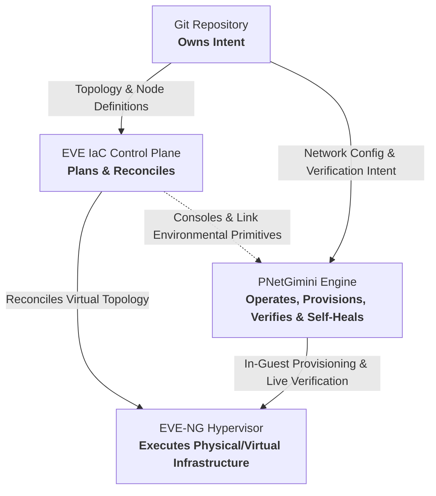
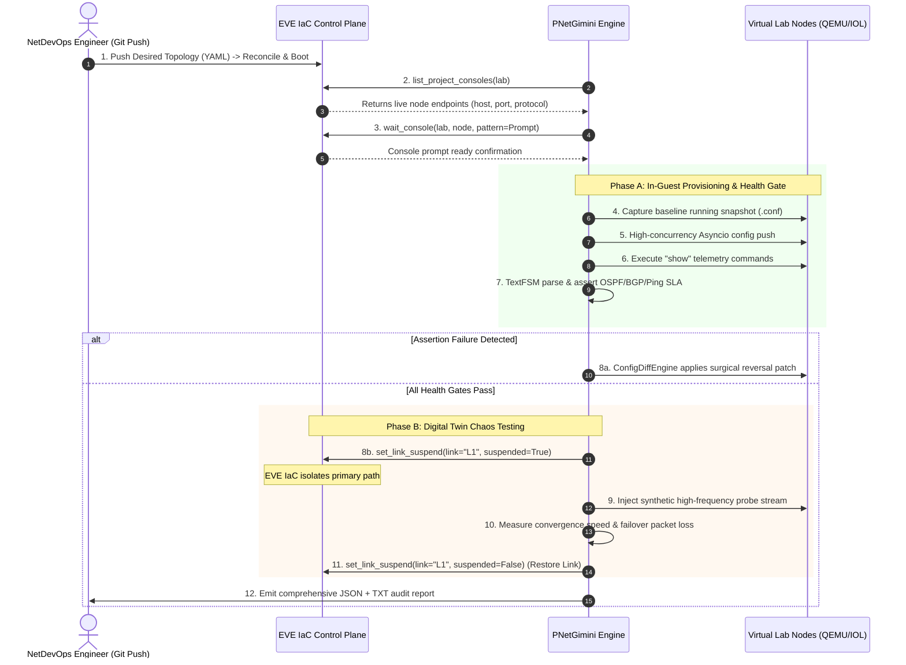
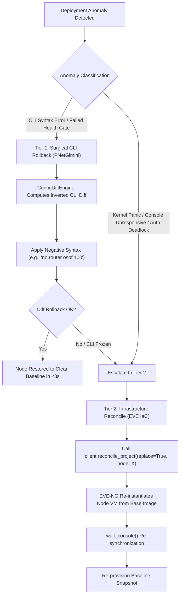

# PNetGimini & EVE IaC Architectural Integration Specification

**Document Version**: 1.0.0  
**Status**: Approved Architecture Design Document (ADD)  
**Target Milestone**: PNetGimini v3.2 – v4.0  
**Classification**: Technical Design Specification & Protocol Contract  

---

## Abstract

This document defines the formal architectural boundaries, API contracts, telemetry verification primitives, and chaos orchestration protocols between **PNetGimini** (the operational deployment and verification engine) and **EVE IaC** (the programmable Infrastructure as Code control plane for network labs and digital twins, created by EVE-NG founder Alain Degreffe).

By adhering to a strict separation of concerns—*"Git owns intent, EVE IaC plans and reconciles, EVE-NG executes, Automation tools operate the lab"*—this specification establishes an immortal architectural foundation designed to outlive ephemeral automation frameworks and enable industrial-grade network digital twin operations.

---

## Table of Contents

1. [Architectural Separation of Concerns](#1-architectural-separation-of-concerns)
2. [The Two-Plane Operational Model](#2-the-two-plane-operational-model)
3. [EVE IaC API & Environmental Primitives Mapping](#3-eve-iac-api--environmental-primitives-mapping)
4. [Declarative Intent Specification (YAML Contract)](#4-declarative-intent-specification-yaml-contract)
5. [End-to-End Orchestration & Chaos Convergence Workflows](#5-end-to-end-orchestration--chaos-convergence-workflows)
6. [Dual-Tier Disaster Recovery & Self-Healing Protocol](#6-dual-tier-disaster-recovery--self-healing-protocol)
7. [Implementation & Traceability Roadmap](#7-implementation--traceability-roadmap)

---

## 1. Architectural Separation of Concerns

### 1.1 The Fundamental Tenet

The architecture is rooted in a four-tier separation of obligations:



### 1.2 Boundary Definitions

1. **Git**: The single source of truth for both structural topology definitions (nodes, links, OS images) and operational networking intent (interfaces, routing protocols, ACLs, quality gates).
2. **EVE IaC**: The declarative infrastructure control plane. It owns lifecycle reconciliation (boot, stop, link creation, port mapping). It is deliberately designed around **BYOA (Bring Your Own Automation)** and remains agnostic of in-guest CLI syntax, OSPF metrics, or BGP state machines.
3. **EVE-NG**: The bare-metal virtualization runtime (KVM/QEMU, IOL, Dynamips, Docker, Linux bridges).
4. **PNetGimini**: The specialized operational operator. It owns in-guest CLI lifecycle, multi-vendor syntax translation (Cisco IOS, Huawei VRP, Arista EOS, Juniper Junos), pre-flight snapshot capturing, structured TextFSM telemetry assertions, and intra-node diff-based precision rollback.

---

## 2. The Two-Plane Operational Model

The collaboration between EVE IaC and PNetGimini functions as a **two-plane synergy**:

```
+-----------------------------------------------------------------------------------+
|                        INFRASTRUCTURE CONTROL PLANE (EVE IaC)                     |
|                                                                                   |
|  • Virtual Machine & Container Lifecycle (Deploy, Start, Stop, Destroy)           |
|  • Out-of-Band Console Access (Host, TCP Port, Protocol Mapping)                  |
|  • Console Prompt Readiness Synchronization (Go Regex wait_console Probe)         |
|  • Link State Manipulation (Hardware Cable Cut / Link Flap: set_link_suspend)     |
|  • Link Quality Degradation (Delay, Jitter, Packet Loss: apply_link_quality)      |
|  • Whole-Node Infrastructure Lifecycle Rebuild (reconcile_project)               |
+-----------------------------------------------------------------------------------+
                                         ▲
                                         │ Environmental Primitives
                                         ▼
+-----------------------------------------------------------------------------------+
|                     OPERATIONAL & VERIFICATION ENGINE (PNetGimini)                |
|                                                                                   |
|  • High-Concurrency Asyncio Coroutine Engine (AsyncDeploymentEngine)              |
|  • Multi-Vendor Driver Ingestion & Command Pagination (Adapters Factory)          |
|  • Day-0 Console Bootstrap to Day-1/Day-2 In-Band High-Speed Transition           |
|  • Structured Telemetry & Convergence Gate (TextFSM, OSPF, BGP, Ping SLA)         |
|  • Sub-Second CLI Diff-Based Rollback Engine (ConfigDiffEngine)                   |
|  • Sensitive Credential Desensitization (MaskingFilter & Secret Redaction)        |
+-----------------------------------------------------------------------------------+
```

---

## 3. EVE IaC API & Environmental Primitives Mapping

PNetGimini interacts with EVE IaC strictly through typed contracts exposed by the official Python SDK (`eveiac`) and OpenAPI REST endpoints:

### 3.1 Dynamic Inventory & Console Discovery

* **EVE IaC Operation**: `client.list_project_consoles(body: ListProjectConsolesRequest)`
* **OpenAPI Route**: `POST /api/v1/projects/consoles` (`operationId: listProjectConsoles`)
* **Request Payload**:
  ```python
  from eveiac import ListProjectConsolesRequest, pack_lab
  packed = pack_lab("./lab_dc.unl")
  result = client.list_project_consoles(ListProjectConsolesRequest(**packed.payload))
  ```
* **Response Payload (`ConsolesData` / `ConsoleRecord`)**:
  ```json
  {
    "consoles": [
      {
        "node": "1",
        "name": "Spine-01",
        "status": "running",
        "protocol": "telnet",
        "host": "10.10.100.20",
        "port": 32769
      }
    ]
  }
  ```
* **PNetGimini Ingestion**: Automatically transforms `ConsoleRecord` into a [`Device`](file:///D:/OneDrive/2025/Alain/pythonprogram/PnetGimini/src/models/device.py) instance. Automatically infers `device_type` (`cisco_ios_telnet`, `huawei_vrp_telnet`, `arista_eos_telnet`) based on node naming metadata.

### 3.2 Boot Readiness Synchronization (Interaction as Code)

* **EVE IaC Operation**: `client.wait_console(body: WaitConsoleRequest)`
* **OpenAPI Route**: `POST /api/v1/console/wait` (`operationId: waitConsole`)
* **Request Payload**:
  ```python
  from eveiac import WaitConsoleRequest
  result = client.wait_console(WaitConsoleRequest(
      lab="lab_dc.unl",
      node="1",
      pattern=r"([>#]|<.+>|Press RETURN)",
      timeout_ms=300000
  ))
  ```
* **Purpose**: Solves the cold-boot synchronization race condition. Virtual routers (e.g. Cisco IOL, QEMU CSR1000v) take several minutes to extract kernel images. PNetGimini delegates prompt detection to EVE IaC's server-side Go regex probe before dispatching in-guest configuration workers.

### 3.3 Dynamic Topology & Runtime State Inspection

* **EVE IaC Operation**: `client.inspect_project(body: InspectProjectRequest)`
* **OpenAPI Route**: `POST /api/v1/projects/inspect` (`operationId: inspectProject`)
* **Purpose**: Observes live runtime topology, node execution states, and active link connections without mutating desired IaC state. Inspects runtime `source_suspend` and `destination_suspend` indicators.

### 3.4 Chaos & Fault Injection Primitives

1. **Link Flap / Down**:
   * **EVE IaC Operation**: `client.set_link_suspend(body: SetLinkSuspendRequest)`
   * **OpenAPI Route**: `POST /api/v1/projects/links/suspend` (`operationId: setLinkSuspend`)
   * **Invocation**:
     ```python
     from eveiac import SetLinkSuspendRequest
     result = client.set_link_suspend(SetLinkSuspendRequest(
         lab="lab_dc.unl",
         match={"endpoints": [{"node": "Spine-01", "interface": "e0/1"}, {"node": "Leaf-01", "interface": "e0/1"}]},
         suspended=True
     ))
     ```
   * **Semantics**: Simulates physical cable disconnection or optical transceiver degradation directly on live links without altering persistent UNL files.

2. **QoS / Packet Degradation**:
   * **EVE IaC Operation**: `client.apply_link_quality(body: ApplyLinkQualityRequest)`
   * **OpenAPI Route**: `POST /api/v1/projects/links/quality` (`operationId: applyLinkQuality`)
   * **Invocation**:
     ```python
     from eveiac import ApplyLinkQualityRequest
     result = client.apply_link_quality(ApplyLinkQualityRequest(
         lab="lab_dc.unl",
         match={"endpoints": [{"node": "Spine-01", "interface": "e0/1"}, {"node": "Leaf-01", "interface": "e0/1"}]},
         source_impairment={"delay": 50, "jitter": 10, "loss": 2.5, "bandwidth": 100000}
     ))
     ```
   * **Semantics**: Dynamically applies Linux kernel Netem/tc impairments on live Ethernet bridges.

---

## 4. Declarative Intent Specification (YAML Contract)

The operational intent file format decouples Day-1/Day-2 configuration from dynamic hardware coordinates while providing fine-grained verification thresholds:

```yaml
# ==============================================================================
# PNetGimini Declarative Operational Intent Schema (v3.3 Specification)
# ==============================================================================
Spine-01:
  # ----------------------------------------------------------------------------
  # 1. Day-1 Configuration Commands
  # ----------------------------------------------------------------------------
  config:
    - hostname Spine-01
    - interface GigabitEthernet0/1
    - ip address 10.1.1.1 255.255.255.252
    - ip ospf 100 area 0
    - ip ospf cost 20

  # ----------------------------------------------------------------------------
  # 2. Operational Telemetry Commands (Raw Snapshot Retrieval)
  # ----------------------------------------------------------------------------
  show:
    - show ip interface brief
    - show ip ospf neighbor
    - show ip route ospf
    - show ip bgp summary

  # ----------------------------------------------------------------------------
  # 3. Declarative Health Gate Assertions (In-Guest Operational Verification)
  # ----------------------------------------------------------------------------
  verify:
    ping:
      - target: 10.1.1.2
        count: 5
        source: Loopback0
        max_loss_pct: 0          # Must achieve 100% packet delivery
        max_avg_rtt_ms: 20       # Average latency must not exceed 20ms
        vrf: default

    ospf:
      - neighbor_ip: 10.1.1.2
        expected_state: FULL     # Neighbor must reach FULL adjacency
        interface: GigabitEthernet0/1
      - min_total_neighbors: 2   # Node must maintain at least 2 active neighbors
      - route: 10.200.0.0/24
        expected_metric: 20      # Assert calculated OSPF metric matches policy
        expected_path_type: E2   # O / O IA / O E1 / O E2

    bgp:
      - peer_ip: 192.168.100.2
        expected_state: Established
        min_prefixes_received: 10 # Prevents blackholing caused by route-map misconfig

    interfaces:
      - name: GigabitEthernet0/1
        admin_status: up
        line_protocol: up
        max_crc_errors_delta: 0  # Zero increment in CRC errors allowed

    routes:
      - prefix: 10.200.0.0/24
        protocol: ospf
        expected_next_hop: 10.1.1.2

  # ----------------------------------------------------------------------------
  # 4. Digital Twin Chaos Convergence Assertions (EVE IaC Environmental Linkage)
  # ----------------------------------------------------------------------------
  chaos_tests:
    - name: "Spine-Leaf Uplink Failover Verification"
      action: link_suspend
      target_link: "Spine-01:e0/1 <-> Leaf-01:e0/1"
      duration_seconds: 15
      assertions:
        max_failover_loss_packets: 1       # Fast Reroute (FRR) allowed max drop
        max_convergence_time_ms: 1500      # Topology convergence deadline
```

---

## 5. End-to-End Orchestration & Chaos Convergence Workflows



---

## 6. Dual-Tier Disaster Recovery & Self-Healing Protocol

To ensure system resilience across both configuration syntax errors and operating system crashes, PNetGimini implements a **dual-tier self-healing escalation hierarchy**:



---

## 7. Implementation & Traceability Roadmap

| Release | Focus Area | EVE IaC API Contract | Architecture Deliverables | Status |
| :---: | :--- | :--- | :--- | :---: |
| **v3.1** | **Enterprise Security & Desensitization** | `LoginRequest`, Token Injection | `MaskingFilter` credential redaction, `${VAR:-default}` env expansion, SSH key auth, 25 unit tests | **DELIVERED ✅** |
| **v3.2** | **Dynamic Topology & Console Discovery** | `list_project_consoles`, `wait_console` | `EveIacConnector` plugin, automatic vendor driver detection, intent binding, 36 unit tests | **DELIVERED ✅** |
| **v3.3** | **Declarative Health Gate & Chaos Testing** | `set_link_suspend`, `apply_link_quality`, `list_project_links` | `HealthGateEngine`, TextFSM parsing, OSPF/BGP metrics assertions, dynamic chaos orchestrator | **IMMEDIATE TARGET 🚀** |
| **v3.5** | **Dual-Tier Self-Healing Escalation** | `reconcile_project` | Fallback escalation from CLI diff rollback to EVE IaC infrastructure VM recreation | **PLANNED ⏳** |
| **v4.0** | **Complete GitOps Digital Twin Pipeline** | Full REST/SDK OpenAPI Lifecycle | GitHub Actions / GitLab CI standardized workflow templates | **PLANNED ⏳** |

---

*This specification is maintained under configuration management and serves as the authoritative architectural baseline for all future PNetGimini sub-system implementations.*
