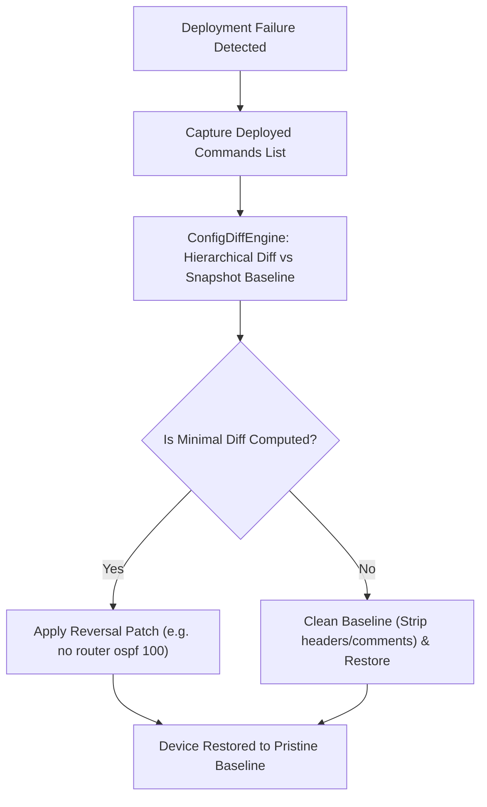

# PNetGimini Core Engine (`src/core`)

This directory houses the execution and orchestration kernel of **PNetGimini**. It implements high-concurrency asynchronous provisioning, vendor syntax normalization, pre-change snapshot lifecycle management, and intelligent diff-based precision rollback.

---

## 🏛 Architecture Overview

```
src/core/
├── adapters/               # Multi-vendor driver abstraction layer
│   ├── base.py             # BaseAdapter abstract class
│   ├── cisco.py            # Cisco IOS / IOS-XE adapter
│   ├── huawei.py           # Huawei VRP adapter
│   └── factory.py          # AdapterFactory for dynamic driver resolution
├── async_engine.py         # Asyncio-powered coroutine deployment engine
├── config_diff.py          # Diff-based precision rollback & patch generator
├── config_parser.py        # YAML configuration parser and object instantiator
├── device_manager.py       # Device lifecycle manager (connect, execute, self-heal)
└── result_handler.py       # Machine (JSON) and human (TXT) audit report generator
```

---

## ⚡ 1. Asynchronous Deployment Engine (`async_engine.py`)

Traditional multi-threaded deployments (`ThreadPoolExecutor`) encounter severe thread context-switching and GIL contention when scaling beyond 50~100+ network devices. 

`AsyncDeploymentEngine` solves this by introducing non-blocking event-loop coroutines with dynamic semaphore flow control:

### Key Highlights:
- **`asyncio.Semaphore(concurrency)`**: Bounds active concurrent SSH/Telnet connections to prevent buffer exhaust or CPU spikes on target devices and network hops.
- **`asyncio.to_thread`**: Offloads blocking socket I/O without freezing the global event loop.
- **Adaptive Throttling**: Tracks cluster success/failure telemetry and dynamically manages execution pacing.

### Code Invocation Example:
```python
import asyncio
from pathlib import Path
from src.core.async_engine import AsyncDeploymentEngine

# Instantiate engine with 20 concurrent coroutine workers
engine = AsyncDeploymentEngine(devices=devices_list, outputs_dir=Path("outputs"), concurrency=20)
results = asyncio.run(engine.run())
```

---

## 🛡️ 2. Intelligent Diff-Based Rollback (`config_diff.py`)

### The Problem with Naive Rollback
Earlier versions attempted rollback by blasting the raw running-config backup back to the device. In real networks, this causes:
1. Syntax errors on non-CLI banners (`Building configuration...`, `Current configuration : 1500 bytes`, timestamps).
2. Interface state conflicts (e.g. attempting to configure an already-shutdown or flapping interface).
3. Lingering orphan configurations (newly added routing processes or routes are NOT deleted by simply reapplying the old baseline!).

### The Solution: Surgical Reversal Patches
`ConfigDiffEngine` treats configuration as a **hierarchical tree (Globals + Context Blocks)**:
1. **New Process / Block Removal**: If a new `router ospf 100` was deployed, it calculates a single surgical negation: `no router ospf 100` (or Huawei `undo ospf 1`).
2. **Interface Attribute Restoration**: If `interface Ethernet0/1` had an IP change and `no shutdown`, the engine enters `interface Ethernet0/1`, restores the original baseline IP, and reverses `shutdown`.
3. **Global Negation**: Deployed global routes or commands are negated in reverse topological order (`no ip route ...`).
4. **Clean Baseline Fallback**: If an unrecoverable discrepancy occurs, the engine strips all noise lines and presents a 100% syntactically clean baseline.



---

## 🔌 3. Multi-Vendor Driver Adapters (`adapters/`)

The adapter package unifies syntax discrepancies between vendors through `AdapterFactory`:

| Feature | Cisco IOS / IOS-XE (`CiscoAdapter`) | Huawei VRP (`HuaweiAdapter`) |
|---|---|---|
| **Pagination Disable** | `terminal length 0` | `screen-length 0 temporary` |
| **Snapshot Command** | `show running-config` | `display current-configuration` |
| **Negation Prefix** | `no ` | `undo ` |
| **Block Exit** | `exit` | `quit` |
| **System View / Config Mode** | `configure terminal` / Privileged EXEC | `system-view` |

### Adding a New Vendor
To add a new vendor (e.g., Arista EOS or Juniper Junos):
1. Create `src/core/adapters/arista.py` inheriting from `BaseAdapter`.
2. Implement abstract methods (`get_disable_paging_command`, `get_snapshot_command`, `get_reversal_prefix`, etc.).
3. Register the new class in `AdapterFactory.get_adapter()`.

---

## 📁 4. Device Manager & Snapshot Lifecycle (`device_manager.py`)

`DeviceManager` orchestrates the complete lifecycle for each individual device:
1. **Connection**: Establishes Netmiko transport using credentials and auto-resolved vendor device types.
2. **Paging Disabled**: Automatically runs vendor-specific pagination disable.
3. **Pre-Change Snapshot**: Executes baseline snapshot and archives to `[Project_Dir]/snapshots/{ip}_{port}_snapshot_{timestamp}.conf`.
4. **Command Pipeline**: Executes commands grouped by category (`config`, `show`, `verify`).
5. **Self-Healing**: Catches socket, Netmiko, or verification errors and immediately triggers the `ConfigDiffEngine`.
